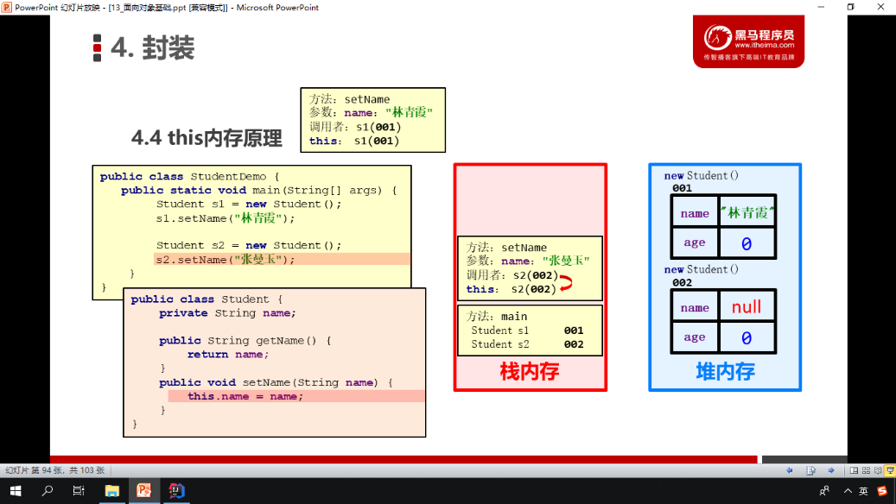
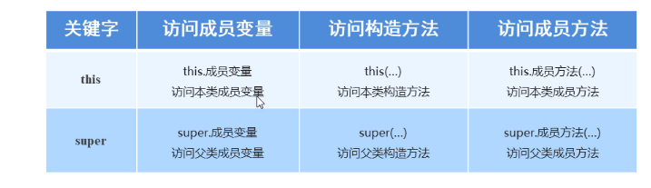
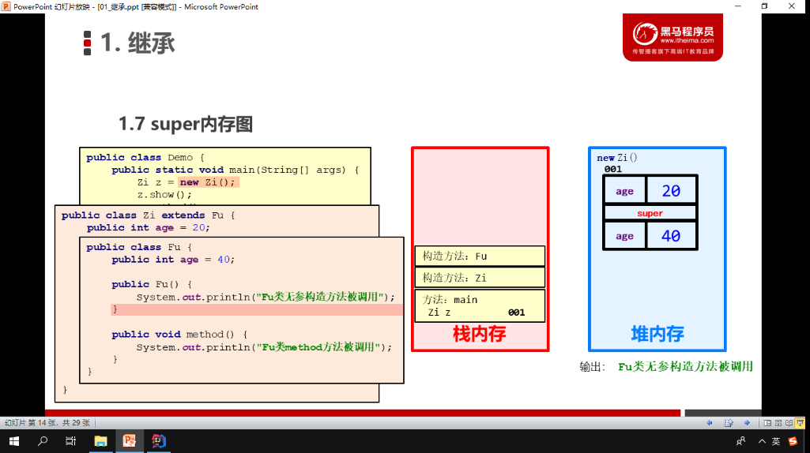
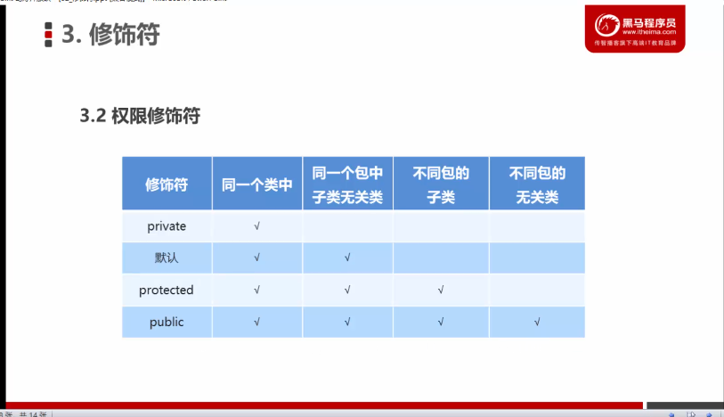
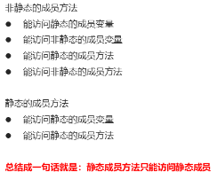
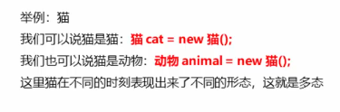
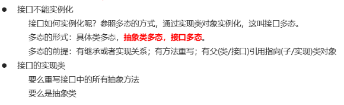
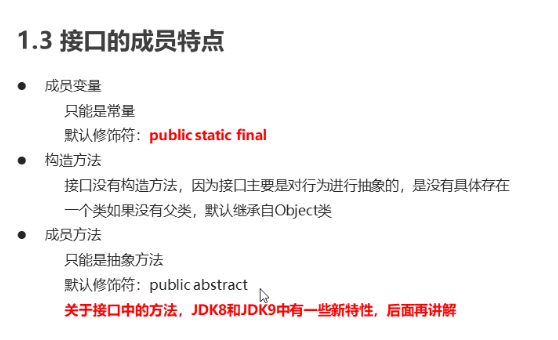
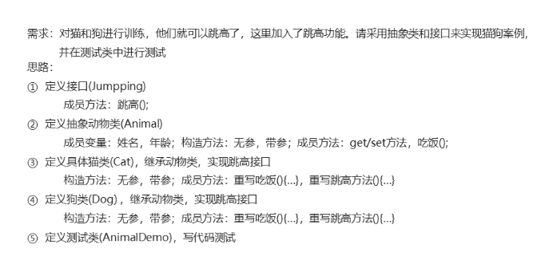
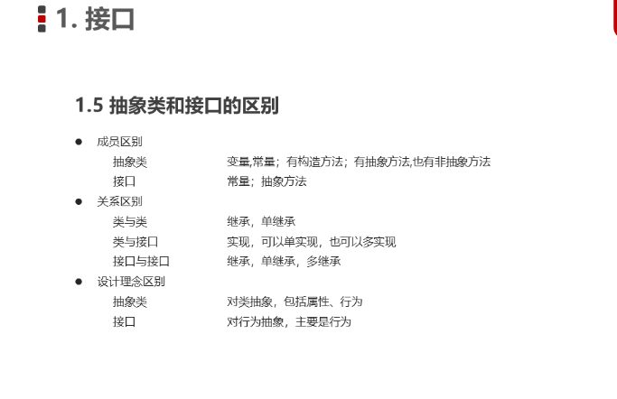

###  选择语句

## switch

```java
switch (num) {
    case 1:
        System.out.println("11");
   // break;
    case 2:
        System.out.println("22");
        break;
    case 3:
        System.out.println("33");
        break;
    default:
        System.out.println("break");
        break;
}
```

输出结果：

11

22

switch语句具有穿透性，即switch如果不写break,将会继续执行下一case，知道结束或出现break为止。

# 循环语句

## for

```java
        int num=1;
        for (int i = 0; i <100 ; i++) {
            System.out.println("嘤嘤嘤,人家错错");
        }
//        System.out.println("end");
```

## while循环

while有标准格式和扩展格式
标准：while（）{}
扩展格式：
	初始化语句；
	while（）{
	循环体
	步进语句}

```java
int i=0;
while(i<=100){
    System.out.println("嘤嘤嘤");
    i++;
}
while (i<=100){
            i++;
        }
        System.out.println(i);
```

## do while循环

```java
int i=0;//初始化
do {
    System.out.println(i);//循环体
    i++;//步进表达试
}while (i<=100);//条件判断
```

## 循环语句的试验

### 求1-100的偶数和

##### for

```java
public class Demo12HundredSum {
    public static void main(String[] args) {
        int sum=0;
        for (int i = 0; i <=100 ; i++) {
            if (i%2==0){
                sum+=i;
            }else {
                sum=sum;
            }
        }System.out.println(sum);

    }
}
```

##### while

```java
int i = 0;
int sum1 = 0;
while (i <= 100) {
    if (i % 2 == 0) {
        sum1 += i;

    }  i++;
}
System.out.println(sum1);
```

##### do while

```java
int x = 1;
int sum2 = 0;
do {
    if (x % 2 == 0) {
        sum2 += x;
    }
    x++;
} while (x <= 100);
System.out.printn(sum2);
```

### 区别

1，条件表达式没有满足的情况下。for和while将不执行，但是do while会执行一次循环体。

2，for循环的循环变量只有在循环内才存在。（在for中的int是在循环内定义的）

## 条件控制语句（循环）

### break

跳出循环

### continue

跳过当前循环剩余内容

```java
for (int i = 1; i <= 10; i++) {
    if (i == 4) {
        continue;
    }
    System.out.println(i + "楼到了");
}
```

输出结果：

## 死循环

```java
public static void main(String[] args) {
    while (true){
        System.out.println("I love you");
    }
    System.out.println("hi");//此句无法访问，因为上述循环一直执行，不能运行到这里
}
```

## 循环嵌套

表达时分秒与总秒数

```java
        int sums=0;
        for (int hour = 0; hour < 24; hour++) {
            for (int minute = 0; minute < 60; minute++) {
                for (int s = 0; s < 60; s++) {
                    sums++;
                    System.out.println(hour+"hour"+minute+"minnte"+s+"s"+"   "+sums+"sum to s");
                }

            }
//            System.out.println(hour+"hour");
        }
```

# 方法

```
修饰符 返回值类型 方法名称（参数类型 参数名称，参数类型 参数名称...）{
方法体
return；
}
```

return：停止方法；将返回值返回给调用处

void只能单独调用

```java
public static void main(String[] args) {
    //单独调用
    sum(10,50);
    /*打印调用*/
    System.out.println(sum(3,5));
    //赋值调用
    int a=sum(50,80);
    System.out.println(a);
}

public static int sum(int a,int b){
    a+=b;
    return a;
}
```

### 有参无参

### 注意事项

- 方法定义在类中，但是不能在方法里定义方法

- 前后顺序无所谓

- 需要调用才会执行

- 有返回值需要返回，且返回值类型要与返回值相同

- 对于void方法，return后不能加返回值，会报错

- 同时只能有一个return被执行到

  

### 方法重载

对于功能类似，参数列表不一，进行整合 是作为重载Overload，即方法名称相同，参数列表不一

好处：只需要记得一个方法名称就可以实现多个功能

- 参数个数不同
- 参数类型不同
- 参数的多类型顺序不同
- 与参数名无关
- 与方法返回值类型无关

sum方法重载

```java
     public static void main(String[] args) {
        System.out.println(sum(1,5));
        System.out.println(sum(2,5,8));
        System.out.println(sum(4,5,8,9));
    }
    public static int sum(int a,int b){
        System.out.println("2个");
        return a+b;
    }
    /*public static double sum(int a,int b){
        System.out.println("2个");
        return a+b+0.0;
    }*/
    public static int sum(double a,int b){
        System.out.println("2个");
        return (int) (a+b);
    }
  /*  public static int sum(double s,int d){
        System.out.println("2个");
        return (int) (s+d);
    }*/
    public static int sum(int  a,double b){
        System.out.println("2个");
        return (int) (a+b);
    }
    public static int sum(double a,double b){
        System.out.println("2个D");
        return (int) (a+b);
    }
    public static int sum(int c,int a,int b){
        System.out.println("3个");
        return a+c+b;
    }
    public static int sum(int c,int d,int a,int b){
        return a+b+c+d;
    }
```

# 由于一时兴起格式化了硬盘并重装系统导致MD文档与Java文件缺少了数组部分以及部分类与对象部分

# 类与接口

## 封装

### private关键字

1. 权限修饰符
2. 修饰成员
3. 保护成员不被别的类使用，被~修饰的成员只能在本类中访问

被其它类使用有相应操作

### get,set方法

1. set

   ```java
       public void setAge(int a){
           age=a;
       }
   ```

   

2. get

   ```java
   public int getAge(){
           return age;
       }
   ```

   

可以直接用get获取值并使用

```java
public class Student {
    private String name;
    private int age;
    public void setName(String n){
        name=n;
    }
    public String getName(){
        return name;
    }
    public void setAge(int a){
        age=a;
    }
    public int getAge(){
        return age;
    }
    public void show(){
        System.out.println(name+":"+age);
    }
}
```

```java
public static void main(String[] args) {
        Student s = new Student();
        s.setName("一号");
        s.setAge(15);
        s.show();

        System.out.printf(s.getName()+"*"+s.getAge());
    }
```

### this关键字

- this用来指代成员变量

  方法的形参如果与成员变量同名，不带this修饰的变量指的是形参，而不是成员变量。

  方法的形参没有与成员变量同名，不带this修饰的变量指的就是成员变量

```java
public void setName(String name){
        //name=name;
        this.name=name;
    }
public void setName(String n){
        name=n;
    }
```

在局部变量与成员变量同名时使用。

方法被哪个对象调用，this就代表哪个对象



### 封装

#### 		原则

​		将类的信息隐藏在类的内部，不允许外部程序直接访问，而是通过类提供的方法来实现对隐藏信息的操作和访问

#### 优点

- 通过方法来控制成员变量的操作，提升安全性
- 封装代码，提高复用性

#### 构造方法

创建对象以完成对数据的初始化

#### 注意事项

1. 系统会给出默认的无参构造方法
2. 已经给出构造方法，系统不会自动给出无参构造方法，需要自己定义
3. 可以重载构造方法

### 标准类

1. 使用private修饰
2. 提供一个无参构造方法
3. 提供有参构造方法
4. 提供每一个成员变量对应的set get方法
5. 提供显示信息show

创建对象并为成员变量赋值有两种方式：

1. 无参构造方法创建对象后用set赋值
2. 有参构造方法直接创建带有属性的对象

## API

应用程序接口

## String类

## StringBuilder

## 继承

子类可继承父类的方法

### 格式

```java
public class 子类名 extends 父类名（）
```

### 子类的特点

1. 子类可以有父类的内容
2. 子类也可以有自己的特有内容

### 继承的优缺点

优点

1. 提高复用性
2. 提高维护性

缺点

1. 削弱了子类的独立性

使用的时候：

 A是B的一种的时候推荐使用，且设置B为父类

### 变量访问特点

- 优先去子类局部范围找
- 然后去子类成员范围找
- 其次才会去父类成员范围找
- 报错（不考虑父类的父类）

### Super

与this类似

​	this为本类对象的引用

​	super为父类对象存储空间的标识



### 构造方法

1. 子类中的所有构造方法都会默认访问父类中的无参构造方法

   #### 原因

   1. 子类会继承父类中的数据，可能会使用，所以子类初始化之前，一定要先完成父类数据的初始化
   2. 没一个子类构造方法的第一条语句默认都是super（）

   父类中没有无参构造方法，只有有参，可以用super在子类的构造方法中访问父类的带参构造方法或者自己提供一个无参构造方法

### 成员方法

通过对象访问一个方法

- 现在子类成员范围找
- 在父类成员范围找
- 报错

### 内存图



## 方法重写

​	子类出现和父类相同的方法说明，即子类需要父类的功能又需要加上独特内容

```java
public class Phone {
    public void call(String name){
        System.out.println("call"+name);
    }
}
```

可以用super调用子类想使用的父类功能

```java
public class NewPhone extends Phone{
    public void call(String name){
        System.out.println("open video");
        //System.out.println("call"+name);
        super.call(name);
        //调用父类打电话功能
    }
}
```

```java
public class PhoneDemo {
    public static void main(String[] args) {
        Phone p = new Phone();
        p.call("people one");
        System.out.println("-----------");
        NewPhone np=new NewPhone();
        np.call("people one");
    }
}
```

注意方法声明

### @override

标记方法为重写父类，如果方法声明有问题，其会报错

### 方法重写的注意事项

1. 父类私有方法子类不能重写
2. 子类访问权限不能更低  public 默认 私有

### 继承的注意事项

1. 只支持单继承，不支持多继承
2. 支持多层继承（套娃）

## 权限修饰符



## 状态修饰符

### final修饰局部变量

#### 

#### 访问特点

1. 基本类型：final修饰的基本类型的值不能改变
2. 引用类型：final修饰的引用类型的地址不能改变，但是地址里的数值或内容可以改变

## static

### 静态关键字

1. 被类的所有对象共享
2. 可以通过类名调用
3. 也可以通过对象名调用但不推荐因为麻烦

### 访问特点



## 多态

同一个对象在不同时刻表现出来的不同形态

### 前提与体现

- 有继承或实现关系
- 有方法重写
- 有父类引用指向子类对象

### 举例



### 成员访问特点

## 接口

一种公共规范

java中更多的体现在对行为的抽象

### 接口的特点

1. 接口使用interface修饰

2. 类实现接口用implements表示

3. 接口不能实例化

   可以参照多态的方式，通过实现类对象实例化，（接口多态）

   

   

### 接口的成员特点




```java
public interface inter {
    public int num=10;
    public  final  int num2=20;
    public static final int num3=30;
    int num4=40;

    //public Inter(){}
    public abstract void methood();
    void show();

}


```

```java
public class interimpl1 extends Object implements inter{

        public interimpl1() {
            super();
        }

        @Override
        public void methood() {
            System.out.println("method");
        }
        @Override
        public void show() {
            System.out.println("show");
        }
}
```

```java
public class interfaceDemo {
    public static void main(String[] args) {
        inter i = new interimpl1();
        //i.num=20;
        System.out.println(i.num);
        //i.num2=40;
        System.out.println(i.num2);
        System.out.println(inter.num);
    }

}
```


### 例子

猫与狗



```java
public interface Jumpping {
    public abstract void jump();
}
```

```java
public abstract class Animal {
    private String name;
    private  int age;

    public Animal() {
    }

    public Animal(String name, int age) {
        this.name = name;
        this.age = age;
    }

    public String getName() {
        return name;
    }

    public int getAge() {
        return age;
    }

    public void setName(String name) {
        this.name = name;
    }

    public void setAge(int age) {
        this.age = age;
    }
    public abstract void eat();
}
```

```java
public class Cat extends Animal implements Jumpping{
    public Cat() {
    }

    public Cat(String name, int age) {
        super(name, age);
    }

    @Override
    public void eat(){
            System.out.println(" cat eat");
        }

    @Override
    public void jump() {
        System.out.println("cat jump");
    }
}
```

```java
public class AnimalDemo {
    public static void main(String[] args) {
        //创建对象 调用方法
        Jumpping j = new Cat();
        j.jump();
        System.out.println();

        Animal a = new Cat();
        a.setName("cata");
        a.setAge(5);
        System.out.println(a.getName() + " " + a.getAge());
        a.eat();
        //a.jump();
        System.out.println();

        a = new Cat("jiafei", 5);
        System.out.println(a.getName() + " " + a.getAge());
        a.eat();
        System.out.println();

        Cat c=new Cat();
        c.setName("jaifei");
        c.setAge(5);
        System.out.println(c.getName()+" "+c.getAge());
        c.eat();
        c.jump();
    }
}
```

```java
public class Dog extends Animal implements Jumpping {
    public Dog () {
    }

    public Dog(String name, int age) {
        super();
    }

    @Override
    public void eat() {
        System.out.println(" cat eat");
    }

    @Override
    public void jump() {
        System.out.println("cat jump");
    }
}
```


### 类和接口的关系

1. 实现

### 接口和接口的关系

继承 可以多继承

### 抽象类和接口的区别




功能的使用方式。

## 形参与返回值


## 抽象类与接口注意事项

抽象类不能直接调用，要先用子类实现，调用的时候使用子类通过多态的形式 实例化后调用。

接口也要用实现类来调用。

### 抽象类

- 抽象类名作为参数的时候，要用的是子类的实例对象
- 抽象类名作为返回值的时候，返回的是子类的实例对象

### 接口

- 接口名作为形参的时候，需要的是接口的实现类对象
- 接口名作为返回值的时候，被返回的将是接口的实现类对象

## 内部类

在一个类中定义一个类，被定义的就是内部类

### 访问特点

- 内部类可以直接访问外部类的成员包括私有成员
- 外部类要访问内部类的成员，必须创建对象

### 成员内部类

在类的成员位置

外界如何创建对象使用

```java
package Day702_InnerClass;

public class Outer {
    private int num=10;
    private class Inner{
        public void show(){
            System.out.println(num);
        }
    }
    public void  method(){
        //show();
        Inner i=new Inner();
        i.show();
    }
}

```

```java
package Day702_InnerClass;
/*ceshilei
* */
public class InnerDemo {
    public static void main(String[] args) {
        //    创建内部类对象并调用方法
//    Outer.Inner i= Outer.Inner();
        //Outer.Inner i= new Outer.new Inner();
        Outer o=new Outer();
        o.method();
    }


}

```

### 局部内部类

```

```

